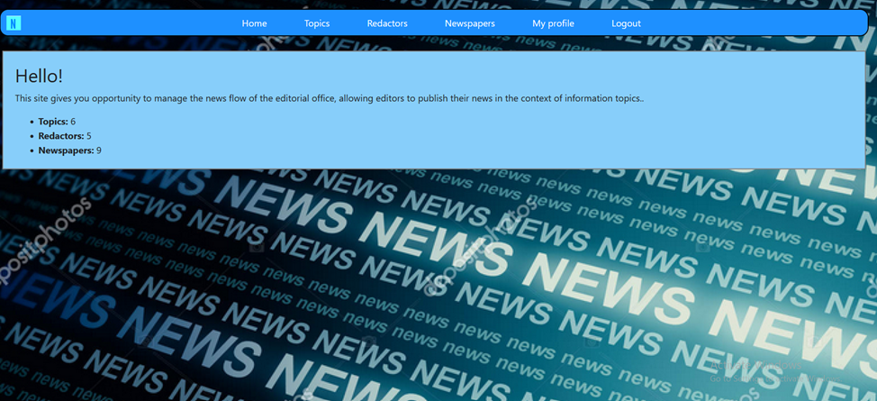
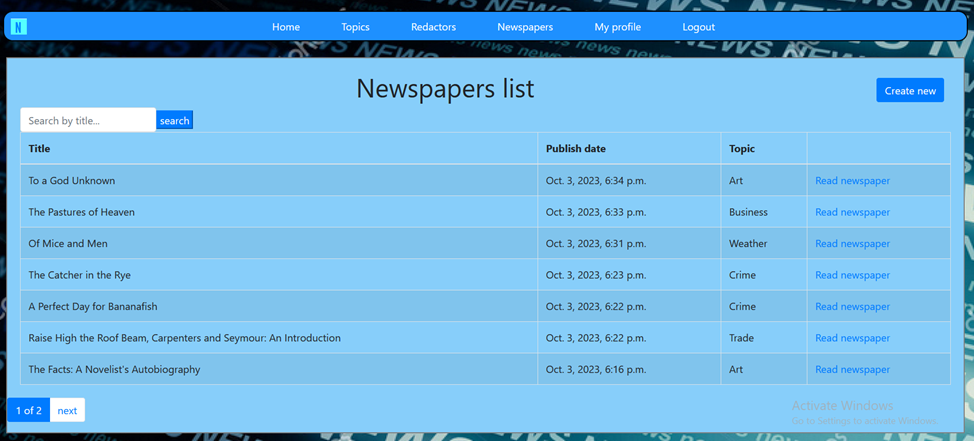
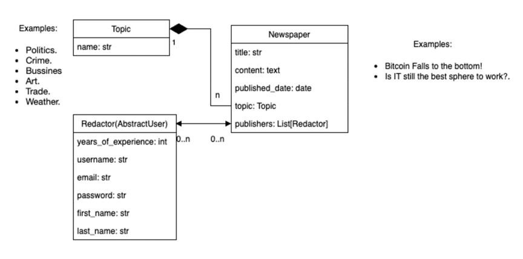

Newspaper Agency Management System

This project was developed to address the need for a comprehensive tracking of redactors assigned to each newspaper in a newspaper agency.

The primary function of the system is to keep track of which redactors are responsible for the publication of each newspaper. This ensures transparency and accountability within the agency.



# Database Structure
NAMS is built on a robust database structure that efficiently stores and retrieves information about the newspapers and their respective redactors. 


## Test User
```
username: admin
password: olehbohatov
```

### Installation

A quick introduction of the minimal setup you need to run it.
(Python should be already installed)

```shell
git clone https://github.com/obohatov/newspaper-agency.git
cd newspaper
python3 -m venv venv
source venv/bin/activate (MacOS)
venv\Scripts\activate (Windows)
pip install -r requirements.txt
python manage.py migrate
python manage.py runserver
```

#### Features

* **Unauthorized** users can only read: list of news, redactors and topics
and their detail pages
* **Authorized** users can add, edit and delete news, redactors and topics
